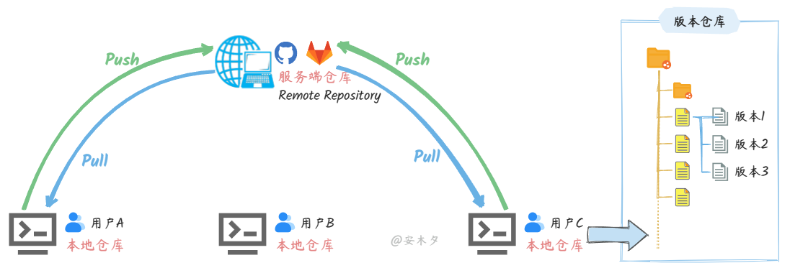
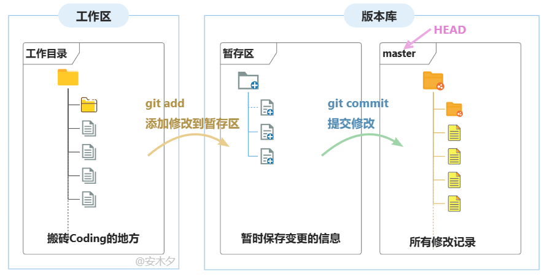
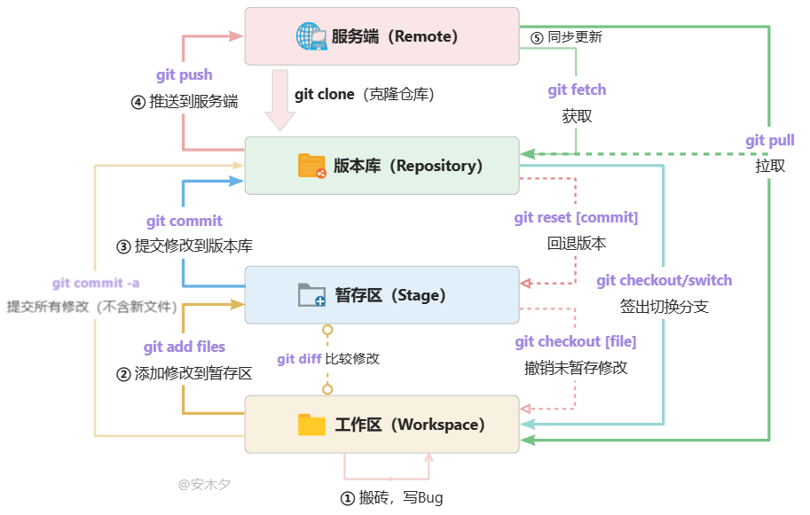

# Git

## 一：基础概念铺垫​​
1. ​为什么要用版本控制？​​
    - 举例说明：手动保存多个文件版本（如 论文_v1.docx、论文_v2.docx）的问题。
    - 引出版本控制系统的核心作用：追踪变化、协同合作、历史回溯。  

## 二：Git 核心概念图解​  
- ​仓库（Repository）​​：项目的“数据库”，保存所有历史记录。
- ​​提交（Commit）​​：一次版本快照，包含唯一 ID、作者、时间、提交信息。
- ​工作区、暂存区、仓库​​：
  - 工作区：你直接编辑的文件夹。
  - 暂存区（Stage/Index）：准备提交的文件的“待打包区”。
  - 仓库：保存提交后的最终版本。  
- ​比喻​​：暂存区像“快递打包区”，仓库像“已发货的快递柜”。  
- ​分支（Branch）​​：独立的时间线，用于隔离不同功能开发（如 main 分支和 feature/login 分支）。    
- ​远程仓库（Remote）​​：团队共享的云端仓库（如 GitHub、GitLab）。





## 三、Git概念汇总
| 概念名称                     | 描述                                                                                                                                 |
|------------------------------|--------------------------------------------------------------------------------------------------------------------------------------|
| 工作区（Workspace）           | 在电脑里能看到的代码库目录，直接编辑文件的地方，新增、修改的文件会提交到暂存区                                                       |
| 暂存区（stage 或 index）      | 临时存放文件修改的区域，实际是文件 `.git/index`，保存待提交的文件列表信息                                                           |
| 版本库/仓库（Repository）     | Git 的管理仓库，记录所有文件/目录的修改历史，存储所有版本数据                                                                       |
| 服务端/远程仓库（origin 或 remote） | 服务端的版本库（如 GitHub、GitLab），承担中心服务器角色，本地通过 `push` 推送代码                                                   |
| 本地仓库                      | 用户机器上直接使用的版本库                                                                                                           |
| 分支（Branch）                | 从主线分离的独立“副本”，可独立操作，仓库初始化默认有主分支 `main`                                                                 |
| 头（HEAD）                    | 类似“指针”，指向当前活动分支的最新版本                                                                                               |
| 提交（Commit）                | 将暂存区的所有变更提交到当前仓库的活动分支                                                                                           |
| 推送（Push）                  | 将本地仓库的版本推送到远程仓库，实现共享                                                                                             |
| 拉取（Pull）                  | 从远程仓库获取更新到本地仓库，并自动合并                                                                                             |
| 获取（Fetch）                 | 从远程仓库更新本地记录（类似 `Pull`，但不会自动合并）                                                                                |
| 冲突（Conflict）              | 多人修改同一文件后合并时产生的冲突，需人工处理                                                                                       |
| 合并（Merge）                 | 合并分支时自动处理变更内容，无法自动处理的冲突需人工介入                                                                             |
| 标签（Tags）                  | 某个分支特定时间点的状态的别名，常用于标记版本（如 `v1.0`）                                                                          |
| master（或 main）             | 默认主分支，初始化仓库时自动创建，GitHub 默认使用 `main`                                                                             |
| origin/master                 | 远程仓库（origin）的 `master` 分支                                                                                                  |
| origin/HEAD                   | 远程仓库（origin）的最新提交位置，通常等于 `origin/master`                                                                           |

## 四、Git提交规范
  - 在Git提交规范中，主要考虑如何提供可读性更好的代码提交记录。 Git提交规范的目标： 
    1. 提供可读性更好的代码提交记录，浏览项目历史记录时更容易理解； 
    2. 可以过滤某些commit（比如文档改动），便于快速查找信息；  
    3. 可以使用commit message来生成Change log。
   - AngularJS Git Commit Message 规范，其Git提交规范比较合理和系统化，并且有齐全的配套工具，我们可以参考或者直接拿来使用。 AngularJS Git Commit Message 规范：Commit message 由Header、Body 和 Footer三个部分组成，其格式如下：
  
```Plain Text
<type>(<scope>): <subject>
<BLANK LINE>
<body>
<BLANK LINE>
<footer>
```
- （必选）type 用于说明commit的类型，只允许使用下面9个标示：
  - build：影响构建系统或外部依赖项的更改（示例范围：gulp，broccoli，npm）
  - ci：对 CI 配置文件和脚本的更改（示例范围：Travis，Circle，BrowserStack，SauceLabs）
  - docs：文档只会更改
  - feat：一项新功能
  - fix：错误修复
  - perf：改进性能的代码更改
  - refactor：代码更改既不修复错误也不添加功能
  - style：不影响代码含义的更改（空格，格式，缺少分号等）
  - test：添加缺失测试或更正现有测试
- （最好有）scope 用于说明当前功能点作用于哪个页面或者哪个功能模块
- （必选）subject 用于简短的描述当前commit，不超过50个字符
- body 用于填写对本次 commit 的详细描述，可以分成多行
- footer 不兼容变动声明，或者关闭 Issue