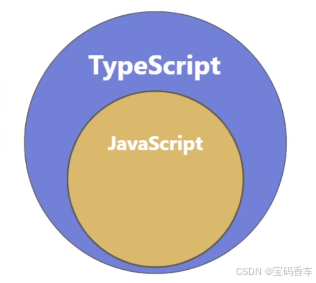

# 一、TypeScript 简介

1. TypeScript 由微软开发，是其于 JavaScript 的一个扩展语言.
2. TypeScript 包含了 JavaScript 的所有内容，即：TypeScript 是 JavaScript 的超集
3. TypeScript 增加了：静态奖型检查、接口、泛型等很多现代开发特性，因此吏适合大型项目的开发。
4. TypeScript 需要编译为 JavaScript,然后交给浏览器成其他 JavaScript 运行环境执行  
   

# 二、为什么要学 TS

```JS
let welcome = 'hello'
welcome() //此行报错：TypeError:welcome is not a function
```

```JS
const message ='hello,world'
message.toupercase()  // 拼写错误
```

# 三、编辑和安装

## 1. 安装

```bash
npm i typescript -g
```

## 2. 自动化编译 ts

1. 第一步：创建 TypeScript 编译控制文件

```bash
tsc --init
```

> ### 补充 bash 命令：
>
> - ls 命令：列出当前文件夹里面的文件和文件夹
>   > 直接使用
> - cd 命令：切换目录
>   > - cd 使用方法:
>   > - `cd <目录名称>`
>   > - `./` 代表当前目录
>   > - `../` 代表上一级目录

2. 第二步：监视目录中的.ts 文件变化

```bash
tsc --watch
```

3. 第三步：优化，当编译出错时不生成.js 文件

```bash
tsc --noEmitonError --watch
```

# (补) 四、变量声明：const、let、var

## 1. 核心差异对比

| 特性         | `var`                        | `let`                | `const`              |
| ------------ | ---------------------------- | -------------------- | -------------------- |
| **作用域**   | 函数作用域                   | 块级作用域           | 块级作用域           |
| **变量提升** | ✅（提升并初始化 undefined） | ✅（提升但不初始化） | ✅（提升但不初始化） |
| **重复声明** | ✅                           | ❌                   | ❌                   |
| **重新赋值** | ✅                           | ✅                   | ❌                   |

---

## 2. 详细解释

### (1) 作用域范围

```javascript
// var 的函数作用域
function varTest() {
  var x = 1;
  if (true) {
    var x = 2; // 相同变量！
    console.log(x); // 2
  }
  console.log(x); // 2
}

// let/const 的块级作用域
function letTest() {
  let x = 1;
  if (true) {
    // let x = 2; // (错误的)不同变量
    x = 2;
    console.log(x); // 2
  }
  console.log(x); // 1
}
```

### (2) 重复声明

```js
var c = 1;
var c = 2; // ✅

let d = 1;
let d = 2; // ❌ SyntaxError

const e = 1;
const e = 2; // ❌ SyntaxError
```

### (3) 重新赋值

```js
var f = 1;
f = 2; // ✅

let g = 1;
g = 2; // ✅

const h = 1;
h = 2; // ❌ TypeError（对于对象可修改属性）
```

## 3. TypeScript 最佳实践

### (1) 优先使用 const​​：

```ts
// 不会修改的值
const PI = 3.14;
const API_URL = "http://api.example.com";
```

### (2) 需要重新赋值时用 let​​：

```ts
let counter = 0;
counter += 1;
```

### ​(3) ​ 永远不要使用 var​​（避免意外作用域泄漏）：

```ts
// ❌ 错误的写法
var total = 0;
// ✅ 正确的写法
let total = 0;
```

## 4. 总结

- const​​ → 必须且只能赋值一次（推荐默认使用）
- ​​let​​ → 允许后续修改（需要时使用）
- ​​var​​ → 文言文时代的遗迹（不要使用）
