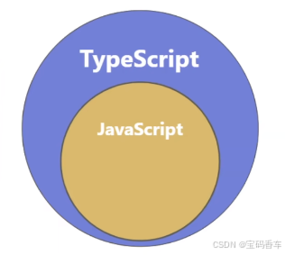

# 一、TypeScript 简介

1. TypeScript 由微软开发，是其于 JavaScript 的一个扩展语言.
2. TypeScript 包含了 JavaScript 的所有内容，即：TypeScript 是 JavaScript 的超集
3. TypeScript 增加了：静态奖型检查、接口、泛型等很多现代开发特性，因此吏适合大型项目的开发。
4. TypeScript 需要编译为 JavaScript,然后交给浏览器成其他 JavaScript 运行环境执行  
   

# 二、为什么要学 TS

```JS
let welcome = 'hello'
welcome() //此行报错：TypeError:welcome is not a function
```

```JS
const message ='hello,world'
message.toupercase()  // 拼写错误
```

# 三、包管理器专题讲解

## 3.1. 什么是"包"？

**比喻**：包就像手机上的 APP

- 别人写好的代码
- 可以直接安装使用
- 不用自己从头开发

**专业定义：**
_**包**_（Package）是 _**封装好的代码模块/方法/函数**_，包含：

- 可复用的代码库
- 版本信息
- 依赖声明
- 文档和许可证

## 3.2. 为什么需要包？

- 传统开发的困境

```ts
// 每个项目都要重复写相同的代码：

// 项目1：日期处理
function formatDate(date) {
  // 手写日期格式化
  // 20行代码
}

// 项目2：日期处理
function formatDate(date) {
  // 重新手写
  // 20行代码
}

// 项目3：日期处理
function formatDate(date) {
  // 再次手写
  // 20行代码
}
```

- 包解决的核心问题

  1. 代码复用

  ```ts
  // 不用包 - 每个项目都要自己写
  // 日期格式化、HTTP请求、工具函数、UI组件...

  // 用包 - 直接安装使用
  import dayjs from "dayjs"; // 日期处理
  import axios from "axios"; // HTTP请求
  import lodash from "lodash"; // 工具函数
  import { Button } from "ant-design"; // UI组件
  ```

  2. 质量保证

  ```ts
  // 自己写的代码
  function sortArray(arr) {
    // 可能有bug
    // 性能可能差
    // 测试不充分
  }

  // 专业包
  import { sortBy } from "lodash";
  // 经过：
  // - 上万次测试
  // - 性能优化
  // - 社区审查
  // - 版本迭代
  ```

  3. 标准化

  ```ts
  // 没有包 - 五花八门，同一个功能不同名称不同传入等等
  project1.sortData(arr);
  project2.arraySort(arr);
  project3.sortArray(arr);

  // 有包 - 标准接口
  import { sortBy } from "lodash";
  // 所有项目都用相同API
  ```

- 包的真正价值

  1. 避免重复劳动

  ```tsx
  // 开发日历功能
  // ❌ 自己实现（耗时耗力）
  function 实现日历功能() {
    // 日期计算
    // 星期计算
    // 闰年判断
    // 国际化
    // 时区处理
    // ...几百行代码
  }

  // ✅ 用包（几行代码）
  import Calendar from "antd/lib/calendar";
  <Calendar />; // 搞定！
  ```

  2. 专注业务逻辑

  ```ts
  // 开发电商网站
  // 不用包：
  实现商品轮播
  实现图片懒加载
  实现无限滚动
  实现表单验证
  实现数据请求
  实现状态管理
  // ... 写完这些，项目还没开始

  // 用包：
  npm install vue
  npm install vue-router
  npm install pinia
  npm install element-plus
  npm install axios
  // 直接开始写业务代码
  ```

  3. 社区协作

  ```ts
  // 一个人的代码
  function 自己写的工具函数() {
    // 只有自己用
    // 只有自己维护
    // 只有自己知道bug
  }

  // 社区的包
  import 社区的包 from "package";
  // 特点：
  // 1. 上万人使用
  // 2. 几百人贡献
  // 3. 几千个issue
  // 4. 持续更新维护
  ```

## 3.3 包的分类和作用

| 包类型     | 作用         | 例子                              | 解决的问题             |
| ---------- | ------------ | --------------------------------- | ---------------------- |
| **框架包** | 项目基础架构 | Vue, React, Angular               | 不用从头搭建框架       |
| **UI 包**  | 界面组件     | Element Plus, Ant Design, Hero UI | 不用手写 UI 组件       |
| **工具包** | 功能函数     | lodash, axios, dayjs              | 不用手写工具函数       |
| **构建包** | 项目构建     | Vite, Webpack, ESLint             | 不用配置复杂工具链     |
| **插件包** | 扩展功能     | vue-router, pinia                 | 不用实现路由、状态管理 |

## 3.4 什么是包管理器？

**包管理器**：管理和安装包的**工具**

**常见包管理器**：
| 工具 | 一句话介绍 | 安装命令 |
|------|-----------|---------|
| **npm** | 最老牌，自带 | `npm install 包名` |
| **yarn** | Facebook 出品 | `yarn install 包名` 或者`yarn add 包名` |
| **pnpm** | 最节省空间 | `pnpm install 包名` 或者 `pnpm add 包名` |
| **bun** | 速度最快 | `bun install 包名` |

**核心功能都一样**：

- 安装包
- 卸载包
- 更新包

## 3.5 npm 基本使用

```bash
# 1. 安装包
npm install 包名

# 2. 卸载包
npm uninstall 包名

# 3. 全局安装（命令行工具）
npm install -g 包名
```

## 3.4. 安装 TypeScript

```bash
# 用npm安装
npm install -g typescript

# 检查是否安装成功
tsc --version
```

**简单说**：

1. 包管理器是工具
2. npm 是最常用的
3. 用 `npm install` 安装 TypeScript
4. 用 `tsc --version` 检查版本

# 四、编辑和安装

## 1. 安装

```bash
npm i typescript -g

# 包管理器：npm, yarn, pnpm ,bun
npm install -g pnpm
npm install -g yarn
npm install -g bun
```

## 2. 自动化编译 ts

1. 第一步：创建 TypeScript 编译控制文件

```bash
tsc --init
```

> ### 【补充】 bash 命令：
>
> - ls 命令：列出当前文件夹里面的文件和文件夹
>   > 直接使用
> - cd 命令：切换目录
>   > - cd 使用方法:
>   > - `cd <目录名称>`
>   > - `./` 代表当前目录
>   > - `../` 代表上一级目录

2. 第二步：监视目录中的.ts 文件变化

```bash
tsc --watch
```

3. 第三步：优化，当编译出错时不生成.js 文件

```bash
tsc --noEmitonError --watch
```

# (补) 五、变量声明：const、let、var

## 1. 核心差异对比

| 特性         | `var`                        | `let`                | `const`              |
| ------------ | ---------------------------- | -------------------- | -------------------- |
| **作用域**   | 函数作用域                   | 块级作用域           | 块级作用域           |
| **变量提升** | ✅（提升并初始化 undefined） | ✅（提升但不初始化） | ✅（提升但不初始化） |
| **重复声明** | ✅                           | ❌                   | ❌                   |
| **重新赋值** | ✅                           | ✅                   | ❌                   |

---

## 2. 详细解释

### (1) 作用域范围

```javascript
// var 的函数作用域
function varTest() {
  var x = 1;
  if (true) {
    var x = 2; // 相同变量！
    console.log(x); // 2
  }
  console.log(x); // 2
}

// let/const 的块级作用域
function letTest() {
  let x = 1;
  if (true) {
    // let x = 2; // (错误的)不同变量
    x = 2;
    console.log(x); // 2
  }
  console.log(x); // 1
}
```

### (2) 重复声明

```js
var c = 1;
var c = 2; // ✅

let d = 1;
let d = 2; // ❌ SyntaxError

const e = 1;
const e = 2; // ❌ SyntaxError
```

### (3) 重新赋值

```js
var f = 1;
f = 2; // ✅

let g = 1;
g = 2; // ✅

const h = 1;
h = 2; // ❌ TypeError（对于对象可修改属性）
```

## 3. TypeScript 最佳实践

### (1) 优先使用 const​​：

```ts
// 不会修改的值
const PI = 3.14;
const API_URL = "http://api.example.com";
```

### (2) 需要重新赋值时用 let​​：

```ts
let counter = 0;
counter += 1;
```

### ​(3) ​ 永远不要使用 var​​（避免意外作用域泄漏）：

```ts
// ❌ 错误的写法
var total = 0;
// ✅ 正确的写法
let total = 0;
```

## 4. 总结

- const​​ → 必须且只能赋值一次（推荐默认使用）
- ​​let​​ → 允许后续修改（需要时使用）
- ​​var​​ → 文言文时代的遗迹（不要使用）


# 四、类型声明

- 使用 `:` 来对变量或函数形参，进行类型声明：

```TS
let a:string     //变量a只能存储字符串
let b:number     //变量b只能存储数值
let c:boolean    //变量c只能存储布尔值
a = 'hello'
a = 100          //警告：不能将类型“number”分配给类型“string”

b = 666
b = '你好'       //警告：不能将类型“string”分配给类型“number”

c = true
c = 666         //警告：不能将类型“number”分配给类型“boolean”

//参数x必须是数字，参数y也必须是数字，函数返回值也必须是数字
function demo(x: number,y: number): number{
  return x + y
}

demo(100,200)
demo(100,'200')        //警告：类型“string”的参数不能赋给类型“number”的参数
demo(100,200,300)      //警告：应有2个参数，但获得3个
demo(100)              //警告：应有2个参数，但获得1个

```

# 五、类型推断

- `TS` 会根据我们的代码进行类型推导。

```TS
let d = -99
d = false   // 报错，不能将类型“boolean”分配给“number”
```

- 但要注意，类型推断不是万能的，面对复杂类型时推断容易出外问题，所以还是尽量明确的编写类型声明！

# 六、类型总览

## 1.类型

1. JS 里面的类型
   - string
   - number
   - boolean
   - null
   - bigint（大整数）
   - undefind
   - symbol（符号）
   - object (里面包含 Arry、function、Data 等)
2. TS 里面的类型
   - 上述的类型
   - 六个新的类型
     - any
     - unknown
     - never
     - void
     - tuple
     - enum
   - 两个用于自定义类型的方式
     - type
     - interface (常用)
3. 注意：全部是小写。在 JS 中这些内置的构造函数：`Number`、`String`、`Boolean` 等，它们用于创建对应的包装对象，在日常开发中 **_很少使用_**,在 TS 中也是同理，所以说在平常的类型声明的时候通常都是小写。

## 2.原始对象和包装对象

### (1) 原始对象

- **原始对象：** 如 `number`、`string`、`boolean` ,在 JS 中是简单的数据类型，它们在内存中占用空间小，处理速度快。
- **特点：​**

  - **不可变（Immutable）** ​​：原始值不能被修改，只能重新赋值。(比如如果你有一个青苹果，你能直接把它“变成”红苹果吗？**不能！** ​​ 你只能扔掉青苹果，换一个新的红苹果。)

    ```TS
    let fruit = "青苹果";
    fruit = "红苹果"; // 不是修改，而是换了一个新苹果！
    ```

  - ​ **按值传递（Pass by Value）** ​​：赋值或传参时，传递的是值的副本。(如果你把一个苹果送给朋友，你手里的苹果会消失吗？→ ​​ 不会！​​ 朋友得到的是一个复制品 ​​，你手里的苹果还在。)

    ```TS
    let myApple = "我的苹果";
    let yourApple = myApple; // 复制了一份给你（yourApple："我的苹果"）
    yourApple = "你的苹果"; // 你修改了你的复制品
    console.log(myApple); // "我的苹果"（我手里的没变！）
    ```

  - 没有方法或属性（苹果自己能削皮吗？→ ​​ 不能！你需要用 ​​ 削皮器工具 ​​（包装对象）来帮忙。）

    ```TS
    let apple = "apple";
    console.log(apple.toUpperCase()); // "APPLE", 临时用工具处理
    ```

### (2) 包装对象

- **包装对象：** 如 `Number`、`String`、`Boolean` ,是 复杂类型，在内存中占用更多的空间，在平常开发中很少由开发者自己创建包装对象。
- **特点：**

  - **对象类型（Object）** ​​，可以使用方法和属性。
    - 普通苹果 ​​（**原始类型**）：只能看，不能自己削皮
    - 工具箱 ​​（**包装对象**）：里面有削皮刀、切片器等工具（方法）
      ```TS
      let apple = "红苹果"; // 普通苹果
      // 当你想用"削皮"功能时
      apple.toUpperCase(); // JS 悄悄把苹果放进工具箱
      ```
  - **临时创建 ​** ​：当对原始值调用方法时，JS 会自动将其转换为包装对象，执行后丢弃。

    ```TS
       let apple: String = "Red apple";
       // JS的步骤：
       // 1. 把苹果装进临时工具箱：new String(apple)
       // 2. 用工具箱的.toUpperCase()工具
       // 3. 用完立即扔掉工具箱
       console.log(apple.toUpperCase()); // "Red apple" → "RED APPLE"
    ```

  - **手动创建**​​：可以使用 new 关键字（但不推荐）

### (3) 包装对象 vs 原始类型 对比 ​

|          | 原始类型（苹果） | 包装对象（工具箱） |
| -------- | ---------------- | ------------------ |
| ​ 类型 ​ | string/number 等 | String/Number 等   |
| 存储 ​   | 直接放在桌上(栈) | 锁在工具箱里       |
| 方法 ​   | 临时借用工具箱   | 自带所有工具       |
| 推荐 ​   | ✅ 平时就用这个  | ❌ 除非特殊需求    |

# 七、常用类型

## 1. any

- 定义：任意类型，一旦将变量设置成 any ，那么就意味着放弃对该变量的检查

  ```TS
  //明确的表示a的类型是any   一   【显式的any】
  let a: any
  //以下对a的赋值，均无警告
  a = 100
  a = '你好'
  a = false

  //没有明确的表示b的类型是any,但TS主动推断出来b是any  一  隐式的any
  let b
  //以下对b的赋值，均无警告
  b = 100
  b = '你好'
  b = false
  ```

- 注意：`any`类型的变量，可以赋值给任何类型的变量

## 2. unknown

- 定义：未知类型
- 可以理解为一个类型安全的 `any` ，适用于：不确定数据的具体类型

  ```TS
  //设置a的类型为unknown
  let a: unknown

  //以下对a的赋值，均正常
  a = 100
  a = false
  a = '你好'

  // 设置x的数据类型为string
  let x: string
  x = a//警告：不能将类型“unknown”分配给类型“string”
  ```

- `unknown` 会强制开发者在使用之前进行类型检查

  ```TS
  // 设置a的类型为unknown
  let a: unknown
  a = 'hello'
  // a = 111    (报错)

  // 第一种方式：加类型判断
  if (typeof a === 'string') {
     x = a
     console.log(x)
  }

  // 第二种方式：加断言(如果确定数据类型,常用)
  x = a as string

  //第三种方式：加断言
  x = <string>a

  let b: any
  y = b
  ```

## 3. never

- 定义：任何值都不是，简而言之就是不能有值，`undefind`、`null`、`""`、`0` 都不行！
- 几乎不用 `never` 去限制变量，因为没有意义，如：

  ```TS
  /*指定a的类型为never,那就意味着a以后不能存任何的数据了*/
  let a: never

  //以下对a的所有赋值都会有警告
  a = 1
  a = true
  a = undefined
  a = null
  ```

- `never` 一般是 TS 主动推断出来的，例如：

  ```TS
  //指定a的类型为string
  let a:string
  //给a设置一个值
  a = 'hello'

  if (typeof a ==='string') {
     console.log(a.toUppercase())
  }else{
     console.log(a) // TS会推断出此处的 a 是 never,因为没有任何一个值符合此处的逻辑
  }
  ```

## 4. void

- 定义：`void` 通常用于函数返回值声明, 表示函数不返回任何值。

  ```TS
  //无警告
  function logMessage(msg: string): void {
    console.log(msg)
  }
  //无警告
  function logMessage2(msg: string): void {
    console.log(msg)
    return;
  }
  //无警告
  function logMessage3(msg: string): void {
    console.log(msg)
    return undefined
  }
  ```

- 限制函数返回值时，是不是 `undefind` 和 `void` 没有区别呢？答案是有区别的，因为 **返回值类型为 `void` 的函数，调用者不应该依赖其返回值进行任何操作**

  ```TS
  function logMessage(msg: string): void {
     console.log(msg)
  }
  let result = logMessage('你好')
  if (result) { //此行报错：无法测试"void"类型的表达式的真实性
     console.log('logMessage有返回值')
  }
  ```

  ```TS
  function logMessage(msg: string): undefined {
    console.log(msg)
  }
  let result = logMessage('你好')
  if (result) {  //此行无警告
    console.log('logMessage?有返回值')
  }
  ```

- 简单来说：void 包含 undefined。void 是一个广泛的 `“空”` 概念，而 undefined 是这种`“空”` 状态的一种具体形式

## 5. object

- 定义：所有非原始类型，可以是：对象，函数，数组等。**由于太宽泛，所以实际很少用**

  ```TS
  let a:object  //a的值可以是任何【非原始类型】，包括：对象、函数、数组等

  //以下代码，是将【非原始类型】赋给a,所以均符合要求
  a = {}
  a = {name: '张三'}
  a = [1, 3, 5, 7, 9]
  a = function () {}
  a = new String('123')
  class Person {}
  a = new Person()

  //以下代码，是将【原始类型】赋给a,有警告
  a = 1           //警告：不能将类型“number”分配给类型“object”
  a = true        //警告：不能将类型boolean'”分配给类型“object'
  a = '你好'       //警告：不能将类型“string”分配给类型“object'”
  a = null        //警告：不能将类型“nul1”分配给类型“object”
  a = undefined   //警告：不能将类型“undefined”分配给类型“object”
  ```

## 6. tuple

- 定义：元组，一种**特殊的数组类型**，可以**存储固定数量的元素**，而且每个元素的类型是**已知的**且**可以不同**，用于精确的描述一组数组的值，用`?`表示可选内容。

  ```TS
  let arr3:[number, ...string[]]


  //第一个元素必须是string类型，第二个元素必须是number类型:
  let arr1:[string,number]
  //第一个元素必须是number类型，第二个元素是可选的，如果存在，必须是boolean类型:
  let arr2:[number,boolean?]
  //第一个元素必须是number类型，后面的元素可以是任意数量的string类型
  let arr3:[number, ...string[]]
  //可以赋值
  arr1 = ['hello'，123]
  arr2 = [100]
  arr2 = [100, false]
  arr3 = [10, 'hello'，'world']
  arr3 = [10]
  //不可以赋值，arr1声明时是两个元素，赋直的是三个
  arr1 = ['hello',123,false]
  ```

## 7. enum

### (1) 基础定义

- 枚举（Enum）用于定义一组命名的常量集合，适用于有限选项的场景
- 枚举成员默认从 `0` 开始自动递增，也可手动指定值

  ```ts
  // 默认数字枚举
  enum Direction {
    Up, // 0
    Down, // 1
    Left, // 2
    Right, // 3
  }
  // 手动赋值枚举
  enum Status {
    Success = 200,
    NotFound = 404,
    Error = 500,
  }
  ```

### (2) 字符串枚举

```ts
enum LogLevel {
  Info = "INFO-信息",
  Warn = "WARN-警告",
  Error = "ERROR-错误",
}
console.log(LogLevel.Warn); // "WARN-警告"
```

### (3) 常量枚举（编译后会被移除）

```ts
const enum Colors {
  Red,
  Green,
  Blue,
}
let bgColor = Colors.Green; // 编译后直接替换为：let bgColor = 1
```

### (4) 异构枚举（混合类型，不推荐）

```ts
enum BooleanLike {
  No = 0,
  Yes = "YES",
}
```

### (5) 枚举特点

- ​ 反向映射 ​​：可通过值获取键名（仅数字枚举）

  ```ts
  enum Direction {
    Up = 1,
  }
  console.log(Direction[1]); // "Up"
  ```

- ​​ 运行时存在性 ​​：非 const 枚举会生成真实对象

  ```ts
  // 编译后的JS代码
  var Direction;
  (function (Direction) {
    Direction[(Direction["Up"] = 0)] = "Up";
  })(Direction || (Direction = {}));
  ```

- 类型安全 ​​：限制变量取值范围

  ```ts
  function move(direction: Direction) {
    // ...
  }
  move(Direction.Left); // ✅
  move(100); // ❌ 类型错误
  ```

## 8. type

- 定义：可以为任意一种类型创建别名，让代码更加简洁。
- 用法：使用关键字 type 定义，取个别名，然后等于号后面跟类型名称。

  ```ts
  type num = number;
  let price: num;
  price = 100;
  ```